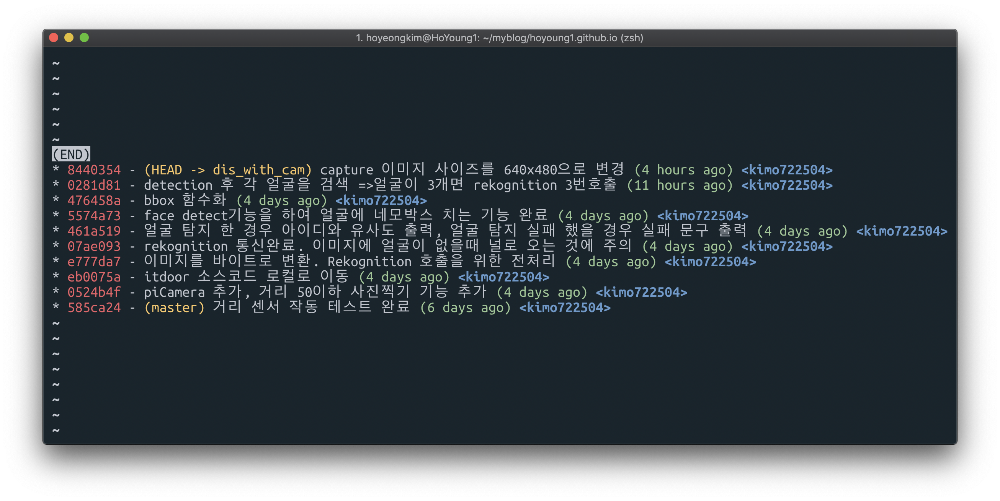

git log 를 이쁘게 찍어보자 

```bash
$ git log --graph --pretty=format:'%Cred%h%Creset -%C(yellow)%d%Creset %s %Cgreen(%cr) %C(bold blue)<%an>%Creset' --abbrev-commit
```

찍어보면 다음과 같이 나옴



굉장히 이쁘다
하지만 칠 때 마다 저렇게 길게 칠수 없으므로 alias **lg** 로 global config를 해준다.

```bash
$ git config --global alias.lg "log --color --graph --pretty=format:'%Cred%h%Creset -%C(yellow)%d%Creset %s %Cgreen(%cr) %C(bold blue)<%an>%Creset' --abbrev-commit"
```

```bash
$ git lg # 이제 이 명령어로 로그 이쁘게 보임
$ git lg -p # git log -p 명령어 처럼 변경사항도 표시
```

## 참고

[https://coderwall.com/p/euwpig/a-better-git-log](https://coderwall.com/p/euwpig/a-better-git-log)
